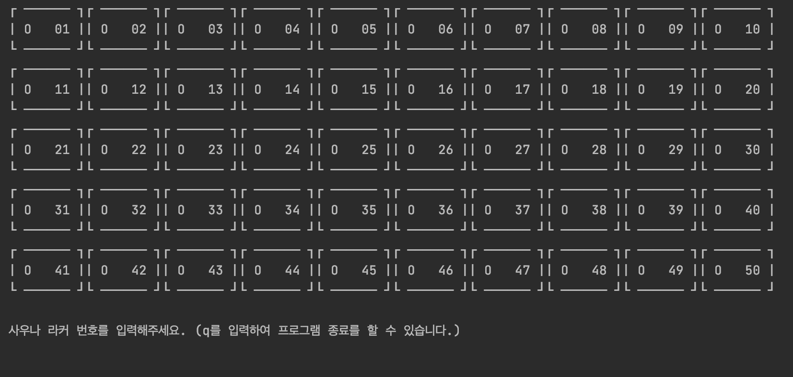
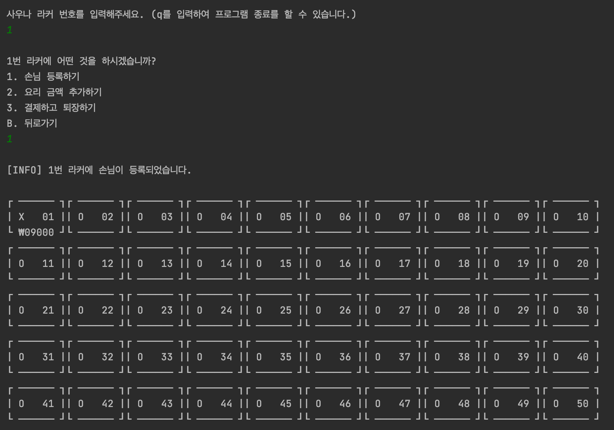
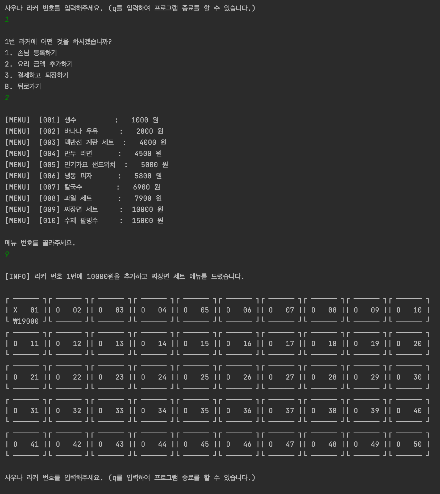
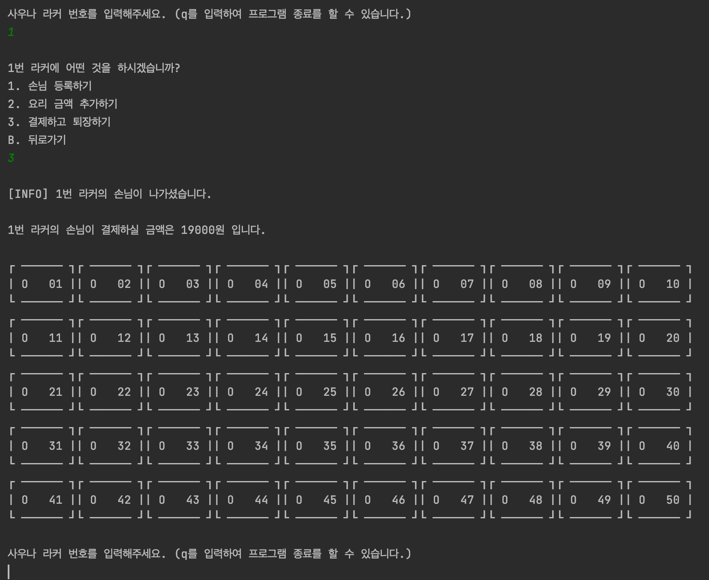
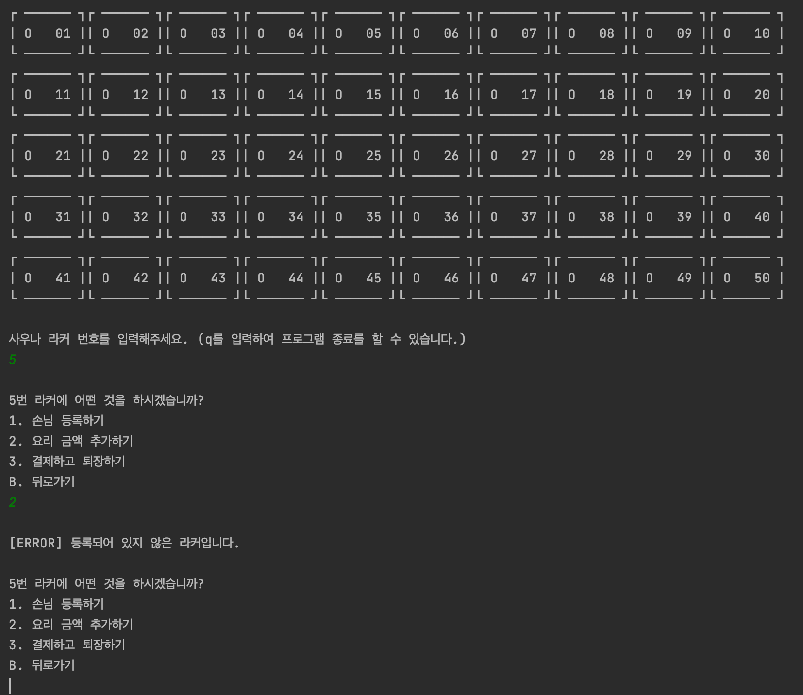
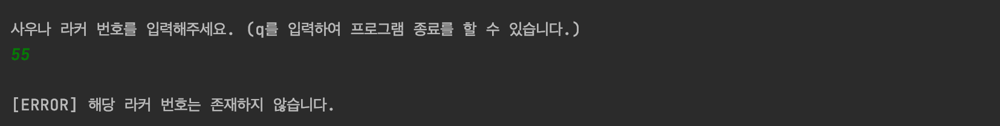
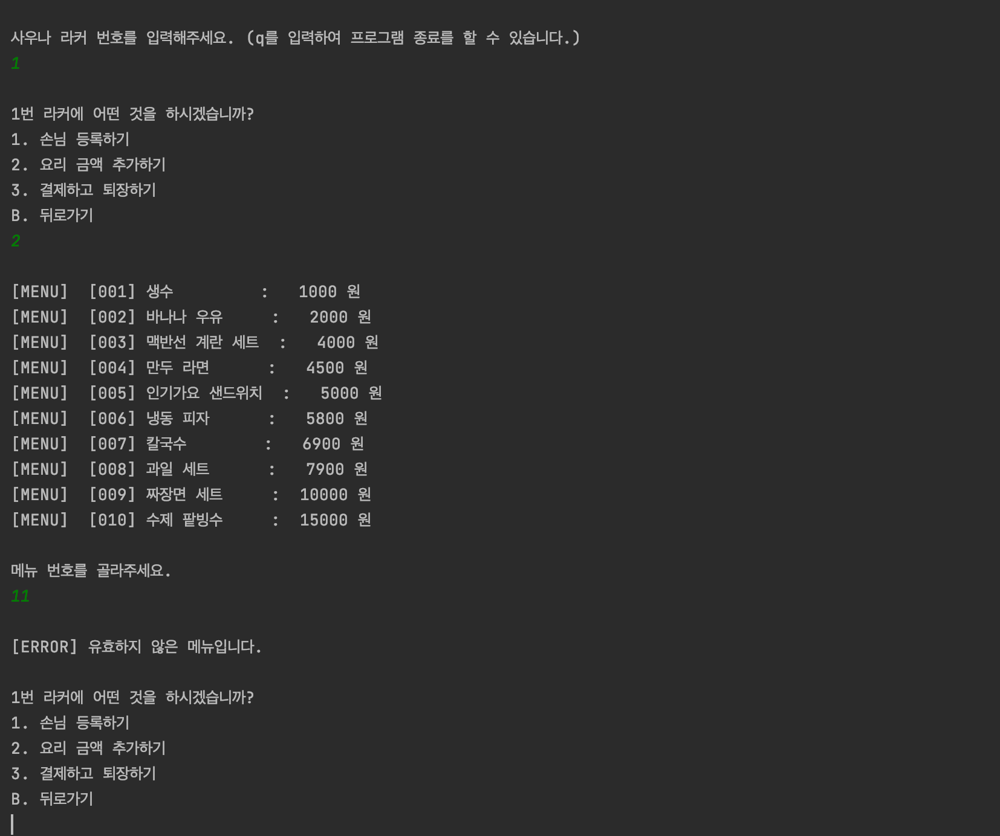
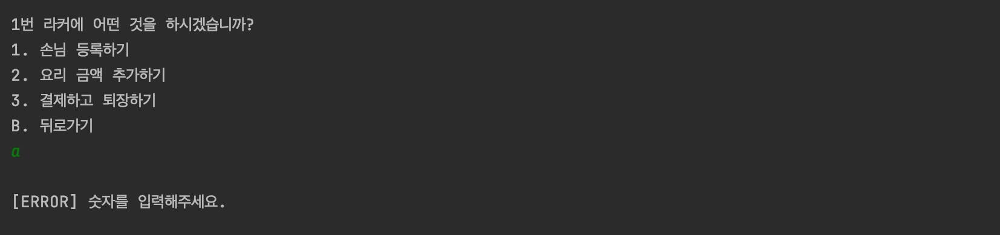

# 미션 - 사우나 라커 관리기
손님이 사우나에 입장할 때 사용하는 라커를 관리한다.

(해당 레포지토리의 pkeugine 브랜치로 가셔서 제가 구현한 코드를 볼 수 있습니다.)

## 🚀 기능 요구사항
- 손님의 사우나 사용 기본 요금은 9000원이다.
- 손님이 음식을 시킬 수도 있으므로, 음식 메뉴를 출력하는 기능도 구현한다.
- 손님이 사우나에서 음식을 먹는 경우 라커 금액에 해당 음식 가격을 포함한다.
- 손님이 사우나에서 퇴장할 때 최종 금액을 보여주고, 해당 라커를 사용 가능한 라커로 바꾼다.
- 라커 사용 최고 금액은 10만원이다. 즉, 음식을 무한정 시킬 수 없다.
- 손님이 사용하지 않고 있는(비어있는) 라커로 음식을 시킬 수 없다.
- 손님이 사용하지 않고 있는(비어있는) 라커에 퇴장 기능을 사용할 수 없다.
- 사용 중 / 사용 가능한 라커를 구분하여 관리화면에 출력한다.
- 사용 중인 라커는 밑에 금액이 얼마인지 출력한다.

 

## ✍🏻 입출력 요구사항

### 💻 프로그래밍 실행 결과 예시
#### 첫 화면

#### 손님 추가

#### 손님 메뉴 주문

#### 손님 퇴장

### ⛔️ 에러 처리
#### 손님이 등록 안된 경우

#### 라커 번호가 존재하지 않는 경우

#### 메뉴 번호가 존재하지 않는 경우

#### 입력이 잘못된 경우

 

## 🎱 프로그래밍 요구사항
- 자바 코드 컨벤션을 지키면서 프로그래밍한다.
  - 기본적으로 [Google Java Style Guide](https://google.github.io/styleguide/javaguide.html)을 원칙으로 한다.
  - 단, 들여쓰기는 '2 spaces'가 아닌 '4 spaces'로 한다.
- indent(인덴트, 들여쓰기) depth를 3이 넘지 않도록 구현한다. 2까지만 허용한다.
  - 예를 들어 while문 안에 if문이 있으면 들여쓰기는 2이다.
  - 힌트: indent(인덴트, 들여쓰기) depth를 줄이는 좋은 방법은 함수(또는 메소드)를 분리하면 된다.
- 3항 연산자를 쓰지 않는다.
- 함수(또는 메소드)의 길이가 15라인을 넘어가지 않도록 구현한다.
  - 함수(또는 메소드)가 한 가지 일만 잘 하도록 구현한다.
- else 예약어를 쓰지 않는다.
  - 힌트: if 조건절에서 값을 return하는 방식으로 구현하면 else를 사용하지 않아도 된다.
  - else를 쓰지 말라고 하니 switch/case로 구현하는 경우가 있는데 switch/case도 허용하지 않는다.
- 프로그래밍 요구사항에서 별도로 변경 불가 안내가 없는 경우 파일 수정과 패키지 이동을 자유롭게 할 수 있다.
- 예외 상황 시 에러 문구를 출력해야 한다. 단, 에러 문구는 `[ERROR]` 로 시작해야 한다.

 

## 📈 진행 요구사항
- 미션은 [java-sauna-practice 저장소](https://github.com/pkeugine/java-sauna-practice) 를 fork/clone해 시작한다.
- 기능을 구현하기 전에 java-sauna-practice/docs/README.md 파일에 구현할 기능 목록을 정리해 추가한다.
- git의 commit 단위는 앞 단계에서 README.md 파일에 정리한 기능 목록 단위로 추가한다.
  - [AngularJS Commit Message Conventions](https://gist.github.com/stephenparish/9941e89d80e2bc58a153) 참고해 commit log를 남긴다.
- [프리코스 과제 제출 문서](https://github.com/woowacourse/woowacourse-docs/tree/master/precourse) 절차를 따라 미션을 제출한다.
 

## 📝 License

This project is [MIT](LICENSE) licensed.
